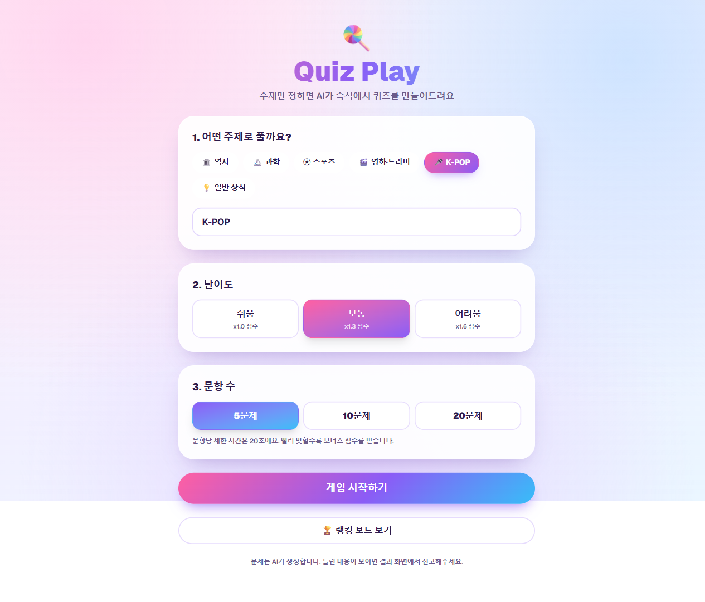
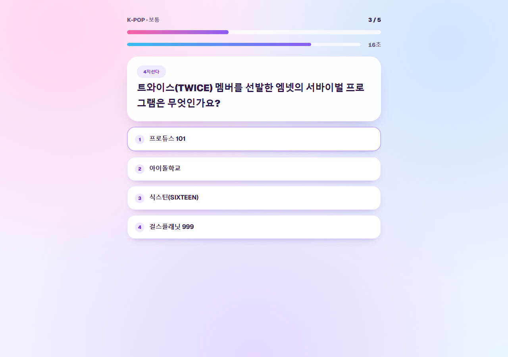
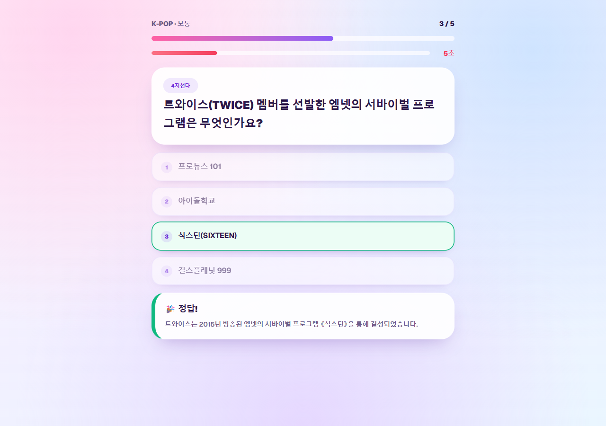
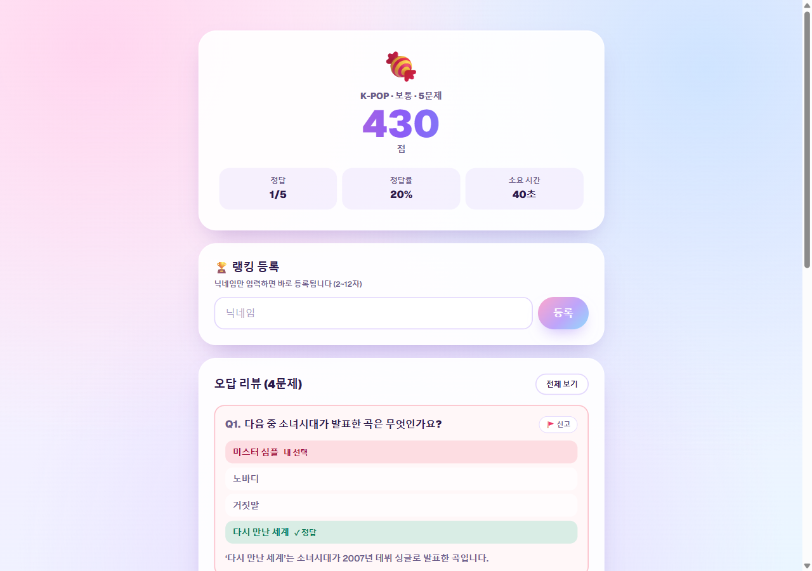
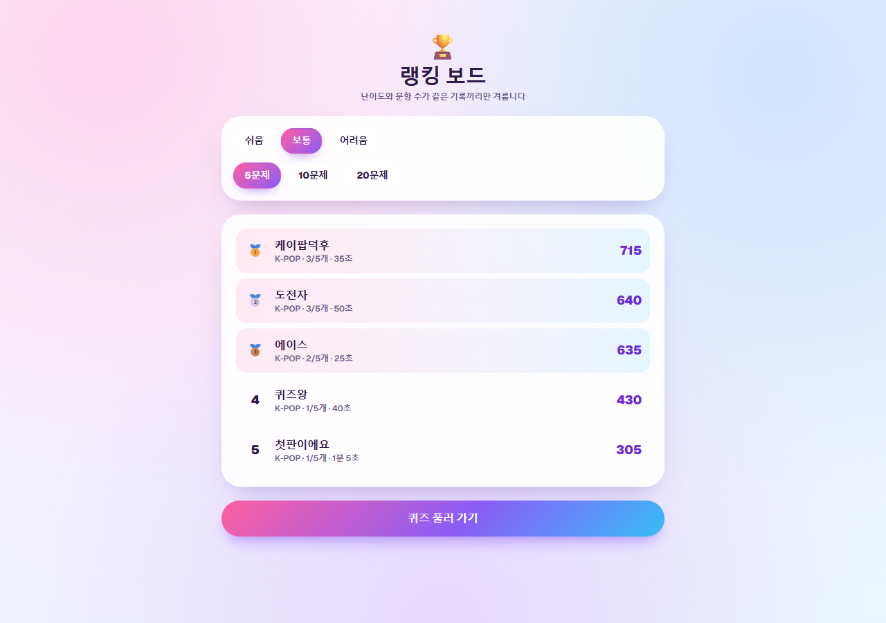

# 🍭 Quiz Play


주제만 입력하면 AI가 즉석에서 퀴즈를 만들어주는 싱글 플레이 웹 퀴즈 게임입니다.
문제 은행을 미리 채워둘 필요 없이, 주제 하나만 있으면 게임이 성립합니다.

요구사항 전문은 [PRD.md](./PRD.md)에 정리되어 있습니다.
원본 화질로 보려면 **[▶ quiz-play-intro.mp4 (1080p · 6.4MB)](docs/quiz-play-intro.mp4)** 를 받으세요.
영상은 Remotion으로 만들었고, 소스는 [`video/`](./video) 에 있습니다.

---

## 화면

### 홈 — 주제 · 난이도 · 문항 수 선택

추천 카테고리 6개(역사 · 과학 · 스포츠 · 영화·드라마 · K-POP · 일반 상식) 중에 고르거나,
직접 원하는 주제를 입력할 수 있습니다.



### 게임 — 문항당 20초

4지선다와 OX가 섞여서 출제됩니다. 위쪽 바는 진행도, 아래쪽 바는 남은 시간입니다.



### 정답 피드백 — 고른 직후에만 공개

정답은 답을 고른 뒤에야 공개되고, 해설이 함께 붙습니다.



### 결과 — 점수 · 오답 리뷰 · 랭킹 등록

총점과 정답률, 소요 시간을 보여주고, 틀린 문제는 내가 고른 답 · 정답 · 해설을 나란히 보여줍니다.
문제가 이상하면 🚩 버튼으로 신고할 수 있습니다.



### 랭킹 보드 — 같은 조건끼리만 비교

난이도와 문항 수가 같은 기록끼리만 순위를 매깁니다. 동점이면 소요 시간이 짧은 쪽이 위로 갑니다.



---

## 빠른 시작

```bash
npm install

# .env.local 에 OpenAI 키만 넣으면 됩니다
echo "OPENAI_API_KEY=sk-..." > .env.local

npm run dev
```

`http://localhost:3000` 으로 접속하면 바로 플레이할 수 있습니다.
DB 설정 없이도 동작합니다 (기록은 프로세스 메모리에 저장).

## 환경 변수

| 이름 | 필수 | 설명 |
| --- | --- | --- |
| `OPENAI_API_KEY` | ✅ | 문제 생성에 사용 |
| `OPENAI_MODEL` | | 사용할 모델. 기본값 `gpt-5.6-luna` |
| `DATABASE_URL` | | Neon 연결 문자열. **없으면 메모리에 저장**하고, 넣으면 자동으로 Neon을 씁니다 |

## 저장소 전환

데모는 별도 설정 없이 프로세스 메모리에 저장합니다 (서버를 끄면 기록이 사라짐).
기록을 영구 보관하려면:

```bash
# .env.local 에 Neon 연결 문자열을 추가한 뒤
npm run db:migrate   # 테이블 생성
npm run dev
```

`src/lib/store/` 아래에 `memory.ts`와 `neon.ts` 두 구현이 있고,
`DATABASE_URL` 유무에 따라 `getStore()`가 알아서 골라 씁니다.

## 게임 규칙

- 시작 전에 **주제 · 난이도 · 문항 수(5/10/20)** 를 고릅니다
- 문항당 제한 시간 **20초**, 시간 초과는 오답 처리
- 점수 = `정답 × 100점 × 난이도 배수(1.0 / 1.3 / 1.6)` + `남은 시간(초) × 5`
- 채점은 전부 서버에서 이뤄지고, 정답은 답을 고른 뒤에만 공개됩니다
- 결과 화면에서 오답 리뷰를 보고, 잘못된 문제는 신고할 수 있습니다 (3회 누적 시 자동 숨김)

## 문제 생성과 캐시

주제를 슬러그로 정규화한 뒤 `슬러그 + 난이도`를 키로 문제를 캐시합니다.
게임을 시작하면 **캐시에서 먼저 채우고, 모자란 개수만** 새로 생성합니다.
같은 주제를 반복해서 플레이해도 문제가 겹치지 않도록 무작위로 뽑습니다.

- 캐시 히트: 1초 이내
- 신규 생성: 15초 내외
- OpenAI 호출은 서버 라우트에서만 이뤄집니다 (API 키가 클라이언트에 노출되지 않음)

## 구조

```
src/
  app/
    page.tsx                  홈 (주제·난이도·문항 수 선택)
    play/[gameId]/            게임 진행
    result/[gameId]/          결과 + 오답 리뷰 + 랭킹 등록
    leaderboard/              랭킹 보드
    api/
      games/                  게임 생성 / 조회 / 답안 / 채점 / 랭킹 등록
      leaderboard/            랭킹 조회
      reports/                문제 신고
  lib/
    quiz.ts                   공용 상수·타입 (점수 공식, 난이도, 카테고리)
    ai.ts                     OpenAI 문제 생성
    questions.ts              캐시 우선 + 부족분만 생성
    games.ts                  게임 진행·채점·랭킹
    store/                    저장소 (memory / neon)
docs/
  screenshots/                README용 화면 캡처
```

## API

| 메서드 · 경로 | 설명 |
| --- | --- |
| `POST /api/games` | 문제 확보(캐시 + 생성) 후 게임 생성. **정답을 뺀** 문제 목록 반환 |
| `GET /api/games/[id]` | 게임·문제 조회 |
| `POST /api/games/[id]/answer` | 답안 1개 기록 |
| `POST /api/games/[id]/submit` | 채점 후 점수·오답 리뷰 반환 |
| `POST /api/games/[id]/score` | 닉네임으로 랭킹 등록 |
| `GET /api/leaderboard` | 난이도·문항 수로 필터해 랭킹 조회 |
| `POST /api/reports` | 문제 신고 |

## 스크립트

| 명령 | 설명 |
| --- | --- |
| `npm run dev` | 개발 서버 |
| `npm run build` | 프로덕션 빌드 |
| `npm run lint` | ESLint |
| `npm run db:migrate` | Neon 스키마 적용 (`DATABASE_URL` 필요) |

## 기술 스택

Next.js 16 (App Router) · React 19 · TypeScript · Tailwind CSS ·
AI SDK v6 (`generateObject` + Zod) · Neon Postgres · Vercel
